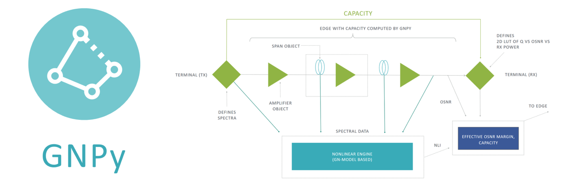
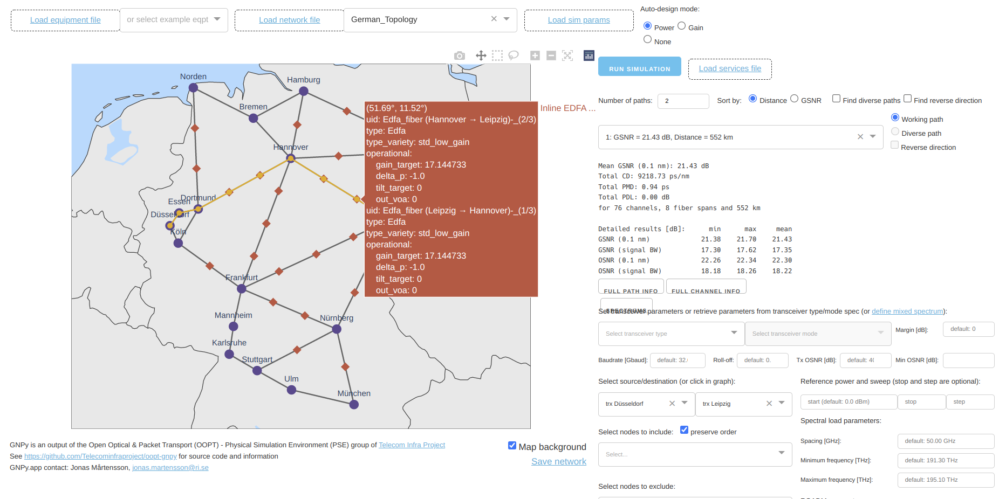

# GNPy: Optical Route Planning and DWDM Network Optimization

GNPy is an open-source, community-developed library for building route planning and optimization tools in real-world mesh optical networks.
We are a consortium of operators, vendors, and academic researchers sponsored via the [Telecom Infra Project](http://telecominfraproject.com)'s [OOPT/PSE](https://telecominfraproject.com/open-optical-packet-transport) working group.
Together, we are building this tool for rapid development of production-grade route planning tools which is easily extensible to include custom network elements and performant to the scale of real-world mesh optical networks.

## Quick Start

Install either via [Docker](https://gnpy.readthedocs.io/en/master/install.html#using-prebuilt-docker-images), or as a [Python package](https://gnpy.readthedocs.io/en/master/install.html#using-python-on-your-computer).
Read our [documentation](https://gnpy.readthedocs.io/), learn from the demos, and [get in touch with us](https://github.com/Telecominfraproject/oopt-gnpy/discussions).

This example demonstrates how GNPy can be used to check the expected SNR at the end of the line by varying the channel input power:

GNPy can do much more, including acting as a Path Computation Engine, tracking bandwidth requests, or advising the SDN controller about a best possible path through a large DWDM network.
Learn more about this [in the documentation](https://gnpy.readthedocs.io/), or give it a [try online at `gnpy.app`](https://gnpy.app/):

